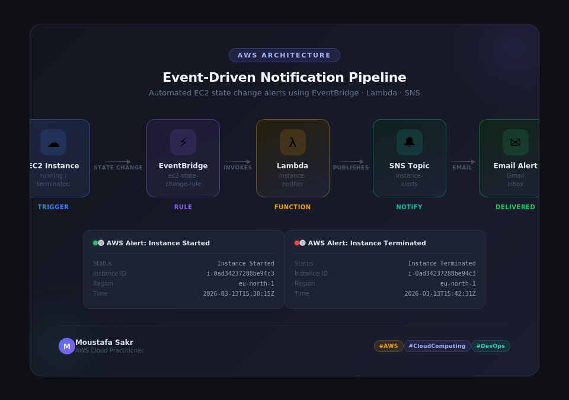
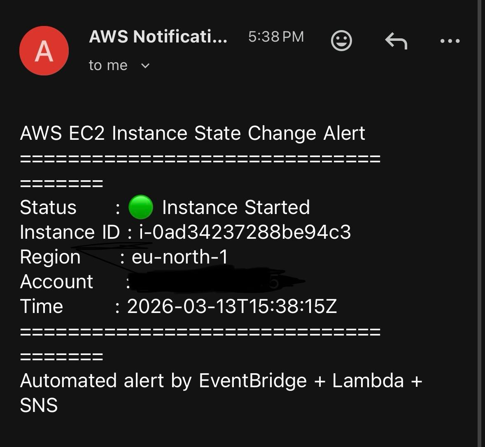
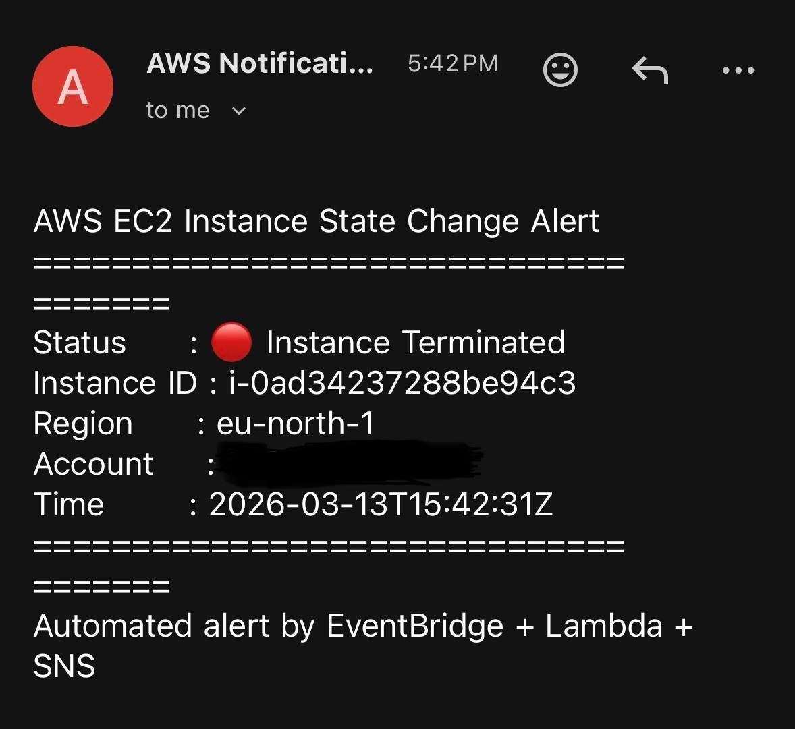

# AWS Event-Driven Notification Pipeline — EC2 State Change Alerts

An event-driven, serverless AWS project that automatically sends an **email alert** every time an EC2 instance changes state (started or terminated) — built entirely with **Amazon EventBridge**, **AWS Lambda**, and **Amazon SNS**, with zero servers to manage and zero polling involved.

---

## 📌 Overview

Instead of manually checking the EC2 console to see whether an instance is running or has been terminated, this pipeline reacts **instantly** to the state change itself. The moment EC2 emits a state-change event internally, EventBridge catches it, triggers a Lambda function to format a readable message, and that message gets published to an SNS topic — which forwards it straight to an email inbox.

**Region used:** `eu-north-1`
**Trigger event:** EC2 instance state transitions (e.g. `running` → `terminated`)
**Delivery channel:** Email (via SNS subscription)

### The Core Idea

> No cron jobs, no polling scripts checking "is the instance still running?" every few minutes. The entire pipeline is **event-driven**: nothing runs and nothing costs money until an actual EC2 state change happens. This is one of the fundamental patterns in modern AWS architecture — reacting to events instead of continuously checking for them.

---

## 🗺️ Architecture Diagram


*The full pipeline, end to end: an **EC2 Instance** changes state (running/terminated) → this **state change** is automatically detected by an **EventBridge rule** (`ec2-state-change-rule`) → EventBridge **invokes** a **Lambda function** (`instance-notifier`) → the function **publishes** a formatted message to an **SNS Topic** (`instance-alerts`) → SNS **delivers** the message by **email** straight to the inbox.*

```
┌──────────────┐   state change    ┌──────────────────┐   invokes    ┌──────────────┐
│ EC2 Instance  │ ────────────────►│    EventBridge     │ ───────────►│    Lambda     │
│ running /     │                  │  Rule:              │             │  Function:    │
│ terminated    │                  │  ec2-state-change-  │             │  instance-    │
│               │                  │  rule               │             │  notifier     │
└──────────────┘                  └──────────────────┘             └──────┬───────┘
     TRIGGER                              RULE                       FUNCTION │
                                                                              │ publishes
                                                                              ▼
                                                                     ┌──────────────┐
                                                                     │  SNS Topic:   │
                                                                     │  instance-    │
                                                                     │  alerts       │
                                                                     └──────┬───────┘
                                                                       NOTIFY │
                                                                              │ email
                                                                              ▼
                                                                     ┌──────────────┐
                                                                     │ Email Alert   │
                                                                     │ (Gmail inbox) │
                                                                     └──────────────┘
                                                                        DELIVERED
```

---

## ⚙️ Prerequisites

- An AWS account with access to EC2, EventBridge, Lambda, and SNS.
- An existing (or new) EC2 instance to test state changes on.
- An email address to subscribe to the SNS topic (subscription must be **confirmed** via the confirmation email SNS sends before it will deliver any alerts).
- Basic IAM permissions allowing Lambda to call `sns:Publish`.

---

## 🚀 How It Works — Step by Step

### 1. The EC2 instance changes state

Every EC2 instance transition (`pending → running`, `running → stopping`, `running → terminated`, etc.) is automatically emitted by AWS as an internal event — no configuration needed on the instance itself for this part.


*The EC2 console showing multiple instances in different states: `test-instance` (`i-0ad34237288be94c3`) is `Running`, while two others are already `Terminated`. Each state transition like this is exactly what the pipeline listens for.*

### 2. Terminating the instance (triggering the "Terminated" event)


*AWS requires an explicit confirmation before terminating an instance, since — as the warning states — **on an EBS-backed instance, the root EBS volume is deleted by default when the instance is terminated**, and this action **cannot be undone**. `Termination protection` is shown as `Disabled` here, meaning the instance can be terminated without first having to disable a safety lock (if it had been `Enabled`, AWS would block termination until the setting was turned off). Clicking **Terminate (delete)** here is what generates the `terminated` state-change event that the pipeline reacts to.*

> **Why does this warning matter?** By default, an EBS-backed EC2 instance's root volume is configured to be deleted along with the instance ("Delete on Termination"). This is fine for stateless, disposable test instances (like this one), but for anything holding important data, you'd want to either detach the volume first or explicitly set "Delete on Termination" to `false` on that volume beforehand — otherwise the data is unrecoverable the moment you confirm this dialog.

### 3. EventBridge detects the change and invokes Lambda

An EventBridge rule (`ec2-state-change-rule`) is configured to match EC2 **state-change notification events** specifically. The moment AWS emits one, EventBridge matches it against this rule and immediately invokes the Lambda function (`instance-notifier`) — passing along the event's details (instance ID, new state, region, timestamp, account).

> **Why EventBridge instead of Lambda polling EC2 directly?** Polling would mean running a Lambda function on a schedule (e.g. every minute) just to *ask* "has anything changed?" — most of those invocations would find nothing new, wasting compute time and money, and worse, introducing up to a full polling interval of *delay* before you find out about a change. EventBridge instead subscribes to the *actual* state-change event stream AWS already emits internally — so the reaction is near-instant, and nothing runs at all when nothing has changed.

### 4. Lambda formats the message and publishes to SNS

The Lambda function receives the raw event payload and formats it into a clean, human-readable message — including the instance's status, ID, region, account, and the exact timestamp of the change — then calls `sns:Publish` to push that formatted message into the SNS topic (`instance-alerts`).

### 5. SNS delivers the alert by email

The SNS topic has an **email subscription** attached to it. The instant a message is published, SNS delivers it to the subscribed inbox — no polling, no delay beyond normal email delivery time.

**"Instance Started" alert:**


*Received at **5:38 PM**: Status = 🟢 **Instance Started**, Instance ID `i-0ad34237288be94c3`, Region `eu-north-1`, Time `2026-03-13T15:38:15Z`. The footer confirms: "Automated alert by EventBridge + Lambda + SNS."*

**"Instance Terminated" alert:**


*Received at **5:42 PM** — just 4 minutes and 16 seconds after the "Started" alert: Status = 🔴 **Instance Terminated**, same Instance ID `i-0ad34237288be94c3`, same region, `Time: 2026-03-13T15:42:31Z`. This confirms the full pipeline correctly fired **twice** for the same instance's two separate lifecycle events, each time within seconds of the actual state change.*

---

## 🌐 Event Flow (Step by Step)

```
1. EC2 instance transitions state
   (e.g. "running" → "terminated")
                       │
2. AWS internally emits an EC2 "Instance State-change
   Notification" event automatically — no setup needed
   on the instance itself
                       │
3. EventBridge's rule (ec2-state-change-rule) is
   continuously listening for exactly this event type
   → it matches, and EventBridge invokes the target
                       │
4. Lambda function (instance-notifier) receives the
   event payload (instance ID, new state, region, time)
   and formats it into a readable message
                       │
5. Lambda calls sns:Publish() to push the message
   into the SNS Topic (instance-alerts)
                       │
6. SNS fans the message out to every subscriber
   of the topic — in this case, a single email
   subscription
                       │
7. The subscriber's inbox receives the formatted
   alert within seconds of the original state change
```

---

## 📚 Key AWS Concepts Explained

| Concept | What it is | Why it matters here |
|---|---|---|
| **Amazon EventBridge** | A serverless event bus that routes events from AWS services (and custom sources) to targets, based on matching rules. | The "trigger" of the whole pipeline — reacts to EC2 state changes the instant they happen, with no polling. |
| **EventBridge Rule** | A pattern that defines *which* events should be matched and *what target* to invoke when they are. | `ec2-state-change-rule` specifically matches EC2 instance state-change notification events. |
| **AWS Lambda** | A serverless compute service that runs your code only in response to a trigger, without provisioning any servers. | `instance-notifier` runs only when a matching EC2 event fires — you pay nothing when nothing happens. |
| **Amazon SNS (Simple Notification Service)** | A fully managed pub/sub messaging service that can fan a single published message out to many subscribers (email, SMS, SQS, HTTP endpoints, etc.). | `instance-alerts` topic delivers the formatted message to an email inbox. |
| **SNS Subscription** | A specific endpoint (like an email address) registered to receive messages published to a topic. | Must be explicitly confirmed via a confirmation email before SNS will deliver any real alerts to it. |
| **Event-Driven Architecture** | A design pattern where components react to events as they occur, rather than being polled or scheduled. | The entire justification for this pipeline's low cost and near-instant alerting. |
| **Termination Protection** | An EC2 instance setting that blocks accidental termination until explicitly disabled. | Seen as `Disabled` in the termination dialog — a safety feature worth enabling on production instances. |
| **EBS "Delete on Termination"** | A per-volume setting controlling whether an EBS root volume is deleted along with its instance. | The termination dialog's warning highlights this — critical for anyone terminating an instance holding real data. |

---

## ✅ Best Practices Applied / Recommended

- Use **EventBridge** for reacting to AWS service events instead of writing custom polling logic — it's cheaper, faster, and removes an entire class of "did I miss an event" bugs.
- Keep the Lambda function's job narrow and simple: format the message and publish it — don't overload a single function with unrelated responsibilities.
- Always **confirm SNS email subscriptions** immediately after creating them — unconfirmed subscriptions silently receive nothing, with no obvious error shown elsewhere.
- Enable **Termination Protection** on any EC2 instance that isn't explicitly disposable/test infrastructure.
- Double-check the **"Delete on Termination"** setting on EBS volumes before terminating any instance holding data you might need later.
- Tag Lambda functions, EventBridge rules, and SNS topics consistently (e.g. a shared project tag) to make cost tracking and cleanup easier later.

---

## ⚠️ Common Mistakes to Avoid

- Forgetting to **confirm** the SNS email subscription — the pipeline will appear to work (Lambda executes, publishes successfully) but no email ever arrives, since SNS silently drops messages to unconfirmed subscriptions.
- Writing an EventBridge rule pattern that's **too broad** (e.g. matching *all* EC2 events instead of just state-change notifications) — leading to noisy, irrelevant alerts.
- Giving the Lambda function's IAM role more permissions than it needs — it should only need `sns:Publish` on the specific topic, not broad SNS or account-wide access.
- Terminating an instance without checking whether its root volume has "Delete on Termination" enabled, when that data actually needs to be kept.
- Not testing both directions of a state-change lifecycle (both "Started" and "Terminated") — as done here — since a rule that only fires for one direction can hide bugs in the pattern matching.

---

## 🧹 Cleanup

To avoid ongoing charges and leave a clean environment, delete resources in this order:

1. Delete the **EventBridge rule** (`ec2-state-change-rule`).
2. Delete the **Lambda function** (`instance-notifier`).
3. Delete the **SNS topic** (`instance-alerts`) — this automatically removes its subscriptions.
4. Terminate the **test EC2 instance** if it's no longer needed (double-check "Delete on Termination" first).

---

## 🏁 Summary

| Component | Purpose | Best Practice |
|---|---|---|
| EC2 Instance | Source of the state-change events | Enable Termination Protection outside of test scenarios |
| EventBridge Rule | Matches EC2 state-change events and triggers the pipeline | Keep the event pattern as narrow/specific as possible |
| Lambda Function | Formats the event into a readable alert and publishes it | Keep the function single-purpose; least-privilege IAM role |
| SNS Topic | Fans the alert out to subscribers | Confirm every subscription immediately after creation |
| Email Subscription | Final delivery channel for the alert | Consider adding more subscribers/channels (SMS, Slack via SNS→Lambda) as needed |

---

**Project result:** A fully serverless, event-driven pipeline that detects EC2 instance state changes (start/terminate) and delivers a formatted email alert — including instance ID, region, status, and exact timestamp — within seconds of the actual event, using only EventBridge, Lambda, and SNS, with zero infrastructure to manage and zero cost when idle.

---

*Built by **Moustafa Sakr** — AWS Cloud Practitioner*
`#AWS` `#CloudComputing` `#DevOps`